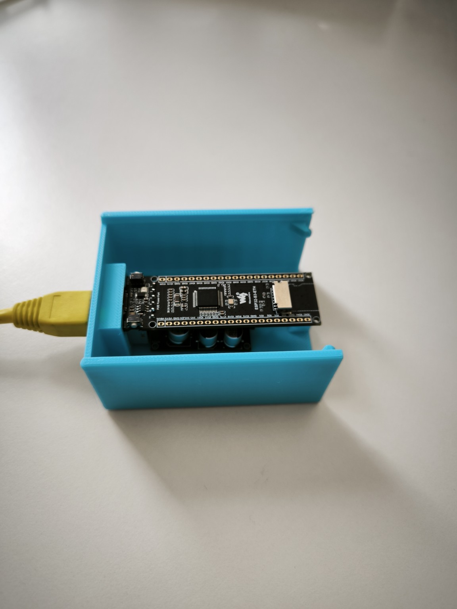
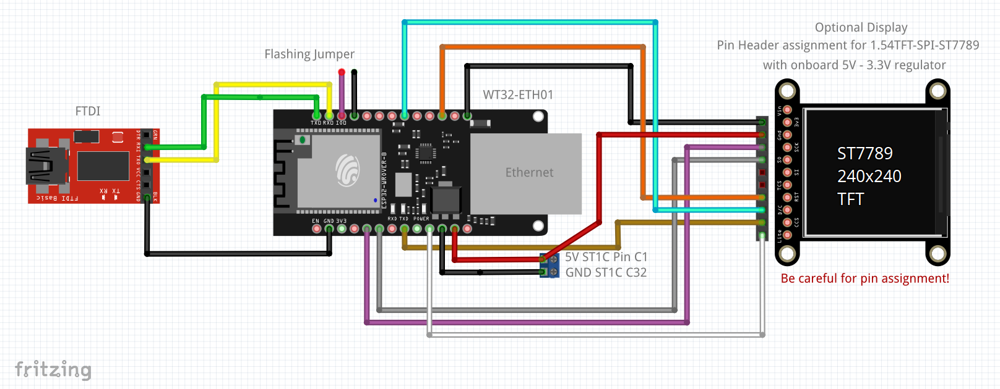
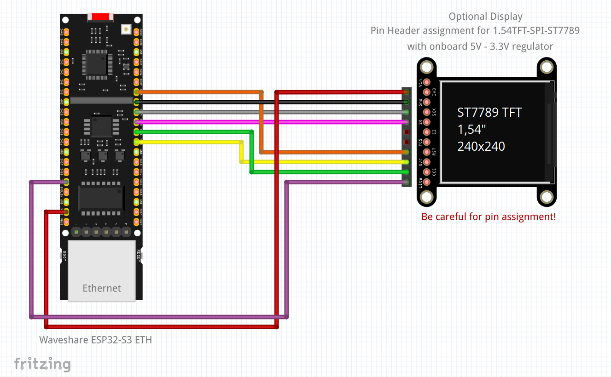
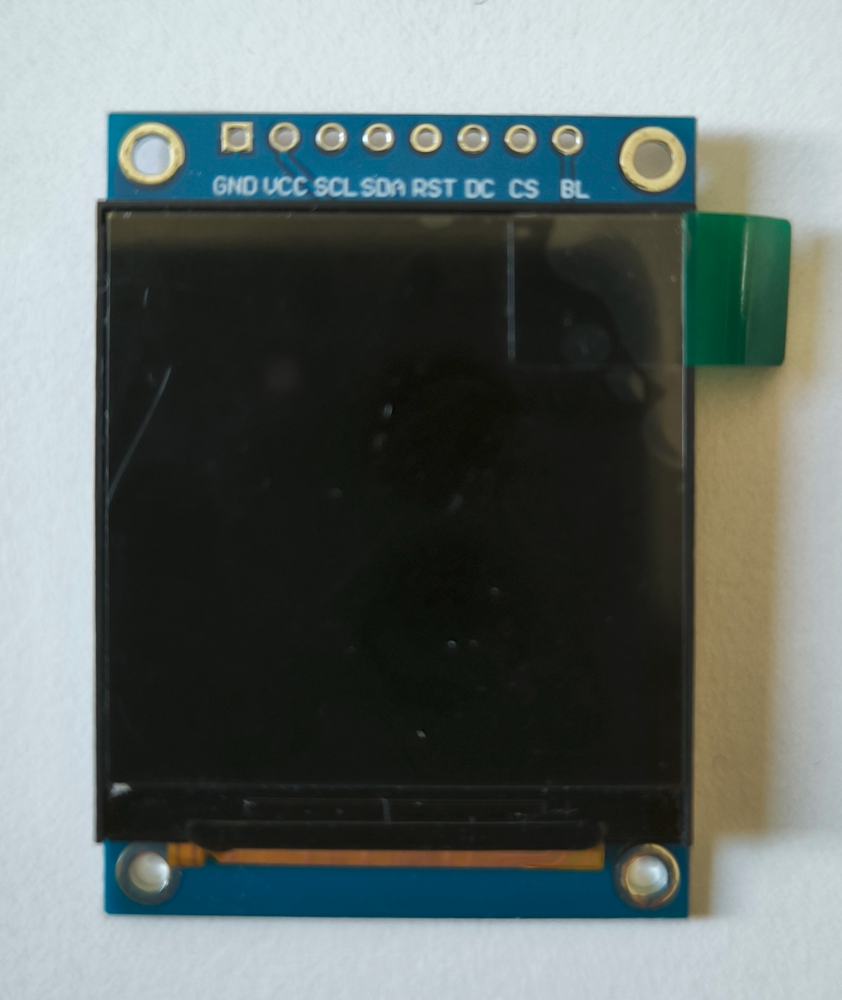
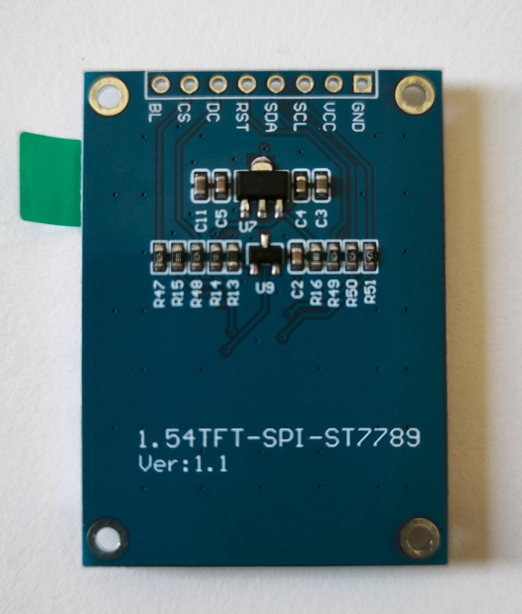

# ESP-WiFiWatch v0.4.8



*Waveshare ESP32-S3-ETH + PoE prototype in the 3D-printed enclosure.*

ESP-WiFiWatch observes the surrounding 2.4 GHz Wi-Fi environment and uses
Ethernet for management, MQTT, Home Assistant and OTA. The main use case is to
recognize a **sudden simultaneous disappearance of normally stable neighboring
access points** as an indication of a wider power outage.

The project also supports a separate watch list for the user's own Wi-Fi
infrastructure.

**Documentation refresh:** the package now contains the verified WT32 and
Waveshare ST7789 wiring diagrams. The Waveshare diagram reflects the wiring
tested on the real board, including `VSYS` display supply and GPIO38-GPIO42.

v0.4.8 is the first multi-platform release. WT32-ETH01 and the Waveshare
ESP32-S3-ETH + PoE board share the same application code and MQTT interface,
with separate PlatformIO hardware profiles.

---

## Why this design?

### Why Ethernet?

ESP-WiFiWatch deliberately does **not** use Wi-Fi as its management connection.

Ethernet carries:

- Web interface
- MQTT
- Home Assistant integration
- OTA firmware updates
- mDNS

This keeps the ESP32 Wi-Fi radio free for scanning the medium it is supposed to
observe. The monitor therefore does not depend on the availability of the Wi-Fi
infrastructure it is watching.

That separation is especially important for the intended power-outage use
case: the monitoring path and the monitored medium should be as independent as
possible.

### Why PoE for the permanent installation?

The WT32-ETH01 can be powered conventionally. The Waveshare ESP32-S3-ETH variant adds a tested PoE option for permanent installation.

PoE is attractive because it provides:

- Ethernet data and power over one cable;
- simple placement at a radio-friendly location;
- central UPS-backed power through the network switch;
- fewer local power supplies and cables.

If the router/switch/PoE infrastructure is connected to a UPS, WiFiWatch can
continue observing the neighborhood while the local mains supply is down.

### Why WT32-ETH01?

The WT32-ETH01 is kept as the **low-cost/reference platform**:

- inexpensive entry point;
- ESP32 with 2.4 GHz Wi-Fi;
- wired 10/100 Ethernet;
- enough GPIOs for the optional ST7789 display;
- suitable for testing whether the Wi-Fi environment at a location is useful
  for this detection method.

This makes it a good option for interested users who want to try ESP-WiFiWatch
without buying the more elaborate PoE hardware.

### Why the selected Waveshare ESP32-S3 Ethernet/PoE board?

The Waveshare ESP32-S3 Ethernet/PoE board is the more convenient permanent
installation option:

- ESP32-S3;
- wired Ethernet;
- PoE option;
- additional memory/resources;
- enough GPIOs for the display;
- **option for an external 2.4 GHz antenna**.

The external antenna option is particularly relevant to this project. The goal
is not merely to see the maximum number of networks; the more useful result is
to receive neighboring BSSIDs **consistently**. A better-positioned external
antenna may turn marginal, fluctuating neighbors into stable baseline members.

The WT32 and Waveshare platforms will be compared side by side before the
Waveshare becomes a recommended permanent variant.

---

# Supported hardware

## v0.4.8

Supported:

- **WT32-ETH01** — low-cost/reference platform
- **Waveshare ESP32-S3-ETH + PoE** — permanent-installation platform
- optional **ST7789 SPI TFT, 240x240** on both platforms

Both environments build from the same source code. The platforms are intended
to be compared side by side before final calibration.

---

# Reference wiring: WT32-ETH01

The following diagram reflects the **tested WT32 wiring**. The CS connection was
corrected from an earlier draft; use this diagram as the reference.



The display is optional. ESP-WiFiWatch runs without it.

## ST7789 wiring used by the reference build

| ST7789 signal | WT32-ETH01 |
|---|---|
| SCL / SCLK | GPIO32 |
| SDA / MOSI | GPIO33 |
| CS | GPIO17 |
| DC | GPIO14 |
| RST / RES | GPIO4 |
| BL / BLK | 3V3 |
| VCC | 3V3 |
| GND | GND |

MISO is not required.

---

# Reference wiring: Waveshare ESP32-S3-ETH

The following wiring has been **tested successfully on the real hardware** with
ESP-WiFiWatch v0.4.8:



## Onboard W5500 Ethernet

The W5500 is wired internally and must not be reused for the display:

| W5500 | ESP32-S3 |
|---|---:|
| RST | GPIO9 |
| INT | GPIO10 |
| MOSI | GPIO11 |
| MISO | GPIO12 |
| SCLK | GPIO13 |
| CS | GPIO14 |

GPIO11-GPIO14 are therefore **not display pins** in the reference design.

## ST7789 reference wiring

The tested display uses a separate group of GPIOs exposed on the normal header:

| ST7789 signal | Waveshare ESP32-S3-ETH |
|---|---:|
| GND | GND |
| VCC | **VSYS (5 V)** |
| SCL / SCLK | **GPIO39** |
| SDA / MOSI | **GPIO40** |
| RST / RES | **GPIO38** |
| DC | **GPIO42** |
| CS | **GPIO41** |
| BL / BLK | **3V3** |

Firmware profile:

```cpp
TFT_RST  = 38;
TFT_SCLK = 39;
TFT_MOSI = 40;
TFT_CS   = 41;
TFT_DC   = 42;
```

### Display power

The tested 1.54" ST7789 module contains an onboard 5 V -> 3.3 V regulator.

For this tested module:

```text
VCC -> VSYS (5 V)
BL  -> 3V3
GND -> GND
```

`VSYS` is preferred over `VBUS` because ESP-WiFiWatch is intended to run from
PoE as well as USB. `VBUS` belongs to the USB 5 V path, while `VSYS` is the
board system supply.

The SPI logic signals remain **3.3 V**.

Other ST7789 modules may have a different supply circuit. Always verify the
actual module before applying 5 V.

## PoE

PoE operation has been tested successfully with the Waveshare PoE module and a
UniFi USW-24-PoE switch.

The PoE variant is intended as the preferred permanent-installation option:
Ethernet and UPS-backed power can be delivered over a single cable.

## External antenna

The Waveshare board provides an IPEX antenna connector. The external antenna is
enabled by moving/resoldering the onboard 0-ohm antenna-selection resistor.

For ESP-WiFiWatch this is an important option because the objective is not only
to detect more BSSIDs, but ideally to make neighboring BSSIDs more consistently
visible. Internal-vs-external antenna comparison is planned as part of the
hardware evaluation.

# Display compatibility

The firmware is intended for **ST7789 SPI TFT modules with 240x240 pixels**.

The tested module is a:

```text
1.54TFT-SPI-ST7789 Ver:1.1
240x240
```

Front:



Back:



## Important: check your actual module

**ST7789 identifies the display controller. It does not guarantee the module's
pin order or supply voltage.**

ST7789 240x240 boards are sold with different:

- pin sequences;
- labels (`SCL`/`SCLK`, `SDA`/`MOSI`, `RES`/`RST`, `BL`/`BLK`);
- regulator circuits;
- backlight circuits;
- 3.3 V / 5 V supply requirements.

Some modules accept 5 V because they contain an onboard regulator. Others
require 3.3 V directly.

**Always verify the labels and specifications of the actual module before
connecting power. Do not copy the physical pin order from another ST7789
module blindly.**

Even with the same ST7789 controller and 240x240 resolution, another module can
occasionally require a changed rotation, RGB/BGR setting or panel offset.

---

# Build, Factory images and OTA

A normal build creates **both hardware variants**:

```bash
pio run
```

The post-build script creates two clearly named images per platform in `firmware/`:

```text
firmware/ESP-WiFiWatch-v0.4.8-WT32-ETH01-OTA.bin
firmware/ESP-WiFiWatch-v0.4.8-WT32-ETH01-Factory.bin
firmware/ESP-WiFiWatch-v0.4.8-Waveshare-ESP32-S3-ETH-OTA.bin
firmware/ESP-WiFiWatch-v0.4.8-Waveshare-ESP32-S3-ETH-Factory.bin
```

### `*-OTA.bin`

This is the normal application image. Use it in ESP-WiFiWatch's **Web Firmware Update** when ESP-WiFiWatch is already installed.

### `*-Factory.bin`

This is a merged first-install image containing the bootloader, partition table, OTA initialization data (when provided by the Arduino framework) and the ESP-WiFiWatch application. Flash the Factory image starting at address **`0x0`** with an ESP flashing tool.

For developers, PlatformIO is still the easiest first-install method because it writes the correct components and addresses automatically:

```bash
pio run -e wt32-eth01 -t upload
pio run -e waveshare-esp32-s3-eth -t upload
```

Build only one platform:

```bash
pio run -e wt32-eth01
pio run -e waveshare-esp32-s3-eth
```

**Never use a WT32 firmware image on the Waveshare board or vice versa.**

The Waveshare build uses a 16 MB OTA partition layout with two 6 MB application slots.

# Network and mDNS

Default hostname:

```text
wifiwatch
```

Default URL:

```text
http://wifiwatch.local/
```

The hostname is configurable. Home Assistant receives the same mDNS URL as its
`configuration_url`.

Ethernet is the management path; the Wi-Fi station is not kept associated with
an access point.

---

# Scanning

Default scan interval:

```text
30 seconds
```

Configurable:

```text
15 ... 300 seconds
```

The interval can be changed from both the web interface and Home Assistant.

The scan interval is stored persistently.

---

# Neighborhood detection model

The composite outage score is calculated from:

```text
50 %  loss relative to the stable long-term baseline
30 %  sudden drop compared with the previous short-term scans
20 %  loss of particularly strong/stable BSSIDs
```

Short-lived SSIDs/BSSIDs such as vehicle hotspots should have little influence
because they normally do not become stable baseline members.

A sudden simultaneous disappearance of previously stable BSSIDs is deliberately
weighted more strongly than a slow change in the raw number of visible SSIDs.

---

# Probability levels in v0.4.8

The raw MQTT value is always English and stable.

| Score | MQTT/internal | Deutsch | English |
|---:|---|---|---|
| learning | `learning` | Lernphase | Learning |
| 0-14 % | `very_unlikely` | Sehr unwahrscheinlich | Very unlikely |
| 15-29 % | `unlikely` | Unwahrscheinlich | Unlikely |
| 30-49 % | `possible` | Möglich | Possible |
| 50-74 % | `likely` | Wahrscheinlich | Likely |
| 75-100 % | `very_likely` | Sehr wahrscheinlich | Very likely |

These thresholds are intentionally documented and may be calibrated further
from long-term real-world data.

## Language behavior

The selected language affects visible text in:

- Web UI
- TFT
- Home Assistant entity names
- the visible Home Assistant `Neighborhood Outage Level` state

The MQTT payload itself remains one of:

```text
learning
very_unlikely
unlikely
possible
likely
very_likely
```

MQTT topics, Home Assistant unique IDs and technical identifiers remain English
and stable regardless of UI language.

---

# Configurable neighborhood alarm threshold

The probability level and the binary alarm are intentionally separate.

The threshold **from which a scan becomes an alarm candidate** is configurable.
Default:

```text
likely
```

Available values:

```text
very_unlikely
unlikely
possible
likely
very_likely
```

The setting is persistent and configurable in:

- Web UI: `Detection / Erkennung`;
- Home Assistant: `Alarm Threshold / Alarm ab Wahrscheinlichkeit`;
- MQTT command topic.

MQTT:

```text
wifiwatch/system/alarm_threshold
wifiwatch/control/alarm_threshold
```

Changing the threshold resets the binary alarm confirmation streak. The
existing two-scan confirmation remains active regardless of the selected
threshold.

# Neighborhood binary alarm confirmation

v0.4.7 deliberately separates **probability level** from the **binary alarm**.

The score and probability level react immediately.

The binary neighborhood alarm requires:

```text
2 consecutive scans at likely or very_likely
```

At the default 30-second interval this is approximately one minute of
confirmation.

This change was introduced after real-world testing showed one-scan RF dropouts
that briefly reached `likely` and caused false binary alarms.

Alarm clearing is also confirmed by two consecutive scans below `likely`, which
reduces chattering.

Importantly, a first `likely`/`very_likely` candidate scan is **not** learned
into the long-term baseline even though the binary alarm is not active yet.

MQTT:

```text
wifiwatch/neighborhood/alarm
```

Values:

```text
0
1
```

---

# Persistent baseline

The learned BSSID model is stored in ESP32 NVS.

## First start

With no saved baseline, an initial learning phase runs for approximately
10 minutes.

## Reboot with a saved baseline

1. The saved baseline is loaded immediately.
2. Detection can use it from the first scan.
3. A gentle validation phase runs for about 5 minutes.
4. The old baseline is not discarded.
5. Normal slow adaptation resumes if the environment is healthy.

A reboot therefore does not cause a full blind 10-minute learning phase.

## Flash wear

The baseline is not written after every scan.

It is saved:

- after the initial learning phase has matured;
- then, when changed, at most approximately every 30 minutes.

Learning is paused for `likely` and `very_likely` conditions so an outage does
not slowly become the new normal.

---

# Manual baseline controls

Web:

```text
Configuration / Konfiguration -> Baseline
```

Controls:

- **Relearn baseline / Lernphase neu starten**
- **Reset baseline / Baseline löschen**

Both begin a fresh learning phase without deleting unrelated configuration such
as MQTT, language, hostname, watch list or ignore list.

---

# Home Assistant controls

MQTT Discovery creates:

## Relearn Baseline button

```text
wifiwatch/control/relearn
```

## Reset Baseline button

```text
wifiwatch/control/reset_baseline
```

## Scan Interval number

State:

```text
wifiwatch/system/scan_interval_sec
```

Command:

```text
wifiwatch/control/scan_interval_sec
```

Range:

```text
15 ... 300 s
```

---

# Own Wi-Fi Watch List

The user's own SSIDs/BSSIDs can be monitored separately.

They are excluded from the neighborhood outage baseline but remain actively
checked by the own-Wi-Fi watch logic.

MQTT:

```text
wifiwatch/wifi/alarm
wifiwatch/wifi/watch_expected
wifiwatch/wifi/watch_visible
wifiwatch/wifi/watch_missing
```

The own-Wi-Fi alarm requires two consecutive missing scans and clears after two
consecutive healthy scans.

This alarm is independent of the neighborhood power-outage alarm.

---

# Ignore list

Supported:

- ignored SSIDs;
- ignored BSSIDs.

Use BSSID ignore for a precise exclusion when a known device appears with an
empty/unknown SSID in an individual scan.

An empty SSID in an ESP32 scan does not necessarily prove that the network is
configured as a deliberately hidden SSID; the BSSID can simply have been seen
without a usable SSID string in that scan.

---

# MQTT topic structure

## System

```text
wifiwatch/system/status
wifiwatch/system/scan_duration_ms
wifiwatch/system/scan_interval_sec
wifiwatch/system/ignored_count
wifiwatch/system/learning_scans
wifiwatch/system/baseline_status
wifiwatch/system/baseline_entries
```

Baseline status:

```text
learning
validating
valid
```

## Neighborhood

```text
wifiwatch/neighborhood/alarm
wifiwatch/neighborhood/outage_level
wifiwatch/neighborhood/outage_score
wifiwatch/neighborhood/bssid_count
wifiwatch/neighborhood/ssid_count
wifiwatch/neighborhood/hidden_count
wifiwatch/neighborhood/stable_visible
wifiwatch/neighborhood/stable_expected
wifiwatch/neighborhood/baseline_loss_score
wifiwatch/neighborhood/dynamic_drop_score
wifiwatch/neighborhood/quality_loss_score
wifiwatch/neighborhood/channel/1 ... /13
```

## Own Wi-Fi

```text
wifiwatch/wifi/alarm
wifiwatch/wifi/watch_expected
wifiwatch/wifi/watch_visible
wifiwatch/wifi/watch_missing
```

## Commands

```text
wifiwatch/control/relearn
wifiwatch/control/reset_baseline
wifiwatch/control/scan_interval_sec
```

The base topic `wifiwatch` is configurable.

---

# Home Assistant

MQTT Discovery groups the entities under one WiFiWatch device.

The visible entity names follow the selected UI language while object IDs,
unique IDs and topics remain stable.

The device also publishes:

```text
configuration_url = http://<configured-hostname>.local/
```

---

# TFT colors

| State | Color |
|---|---|
| Learning | Cyan / light blue |
| Very unlikely | Green |
| Unlikely | Green |
| Possible | Yellow |
| Likely | Orange |
| Very likely | Red |

The actual appearance of named colors depends somewhat on the individual TFT
panel.

---

# Web access protection

The status page is readable without authentication.

Protected using HTTP Basic Auth:

- configuration;
- Ignore/Watch changes;
- baseline actions;
- firmware update.

Default on a new device:

```text
User: admin
Password: wifiwatch
```

Change the password after initial setup.

HTTP Basic Auth is only a basic LAN protection mechanism; it does not provide
transport encryption.

---

# Debug

Default:

```cpp
#define WIFIWATCH_DEBUG 0
```

Enable serial diagnostics:

```cpp
#define WIFIWATCH_DEBUG 1
```

---

# Roadmap

## v0.4.8

Add the second hardware platform:

- Waveshare ESP32-S3 Ethernet + PoE
- same application logic and MQTT interface
- separate PlatformIO environment / hardware profile
- first A/B test with both internal antennas
- second A/B test with external antenna on the Waveshare

If both platforms produce sufficiently comparable detection behavior, both
remain officially supported:

- WT32-ETH01 as the inexpensive entry/reference option;
- Waveshare ESP32-S3 Ethernet/PoE as the convenient permanent-installation
  option.

## Later

- IPv6
- continued threshold calibration from long-term data


---

# v0.4.8 multi-platform notes

## Default names for side-by-side testing

To avoid MQTT/mDNS collisions on a fresh installation:

WT32-ETH01 defaults:

```text
hostname: wifiwatch
MQTT base topic: wifiwatch
```

Waveshare defaults:

```text
hostname: wifiwatch-waveshare
MQTT base topic: wifiwatch-waveshare
```

Existing NVS configuration is preserved on upgrades.

## TFT German umlauts

The built-in small TFT font does not reliably render all UTF-8 umlauts.
Therefore the TFT uses the ASCII-safe form:

```text
MOEGLICH
```

Web UI and Home Assistant continue to display:

```text
Möglich
```

## Baseline status language in Home Assistant

MQTT remains technically stable:

```text
learning
validating
valid
```

Home Assistant displays these values in the selected UI language:

```text
Lernphase / Learning
Validierung / Validation
Gültig / Valid
```
